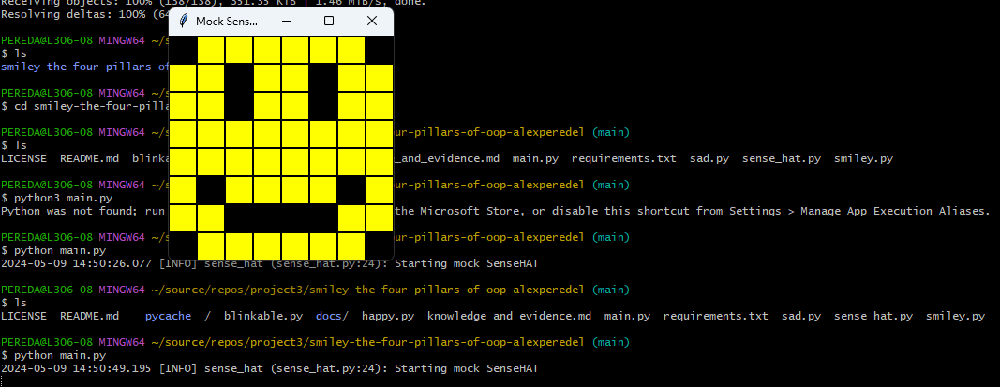
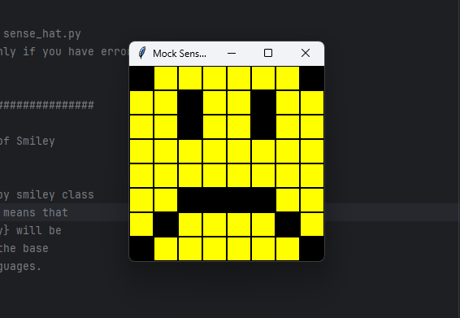

# Evidence and Knowledge

This document provides the structure to evidence your relevant knowledge and skills for this activity.


## Required evidence

### Answer all questions in this document

- Each answer should be complete, well-articulated, and within the specified word count limits (if added) for each question.
- Please make sure all external sources are properly cited.
- You must use your own words. If you use generative AI in any capacity, you must include your full chat transcripts.

### Make all the required modifications to the code

- Please follow the instructions in this document to make the necessary changes to the code.

- When requested to upload evidence, upload all screenshots to `screenshots/` and embed them in this document. For example:

```markdown

```

- You must upload the code into this GitHub repository.
- While you can use a branch, your code should be in main when you submit.
- Upload a zip of this repository to Blackboard when you are ready to submit.
- Feedback will be provided via GitHub, but you will be notified of your result via Blackboard

### Use of Raspberry Pi and SenseHat

The use of Raspberry Pi and SenseHat is optional for this activity. You can use the included ` sense_hat.py` file to simulate the SenseHat on your computer.

If you use a PI, please **delete** the `sense_hat.py` file.

### Accessible version of the code

This project relies on visual patterns that appear on an LED matrix. If you have any accessibility requirements, you can use the `udl/accessible` branch to complete the project. This branch provides an accessible code version that uses text-based patterns instead of visual ones.

Please discuss this with your lecturer before using that branch.

## Specific Tasks & Questions

Address the following tasks and questions based on the code provided in this repository.

### Set up the project locally

1. Clone this repository
2. Run the project locally by executing the `main.py` file
3. Evidence this by providing screenshots of the project directory structure and the output of the `main.py` file



If you are running on a Raspberry Pi, you can use the following command to run the project and then screenshot the result:

```bash
ls
python3 main.py
```

### Identifying and understanding classes

> Note: Ignore the `sense_hat.py` file when answering the questions below

1. List all the classes you identified in the project. Indicate which classes are base classes and which are subclasses. For subclasses, identify all direct base classes. Use the following table for your answers:

| Class Name | Super or Sub? | Direct parent(s)  |
| ---------- |---------------|-------------------|
| Blinkable  | Sub           | ABC               |
|  Happy     | Sub           | Smiley, Blinkable |
| Sad        | Sub           | Smiley            |
| SenseHat   | Super         | -                 |
| Smiley     | Super         | -                 |

...

2. Explain the concept of 'abstraction' as demonstrated in this project. (Max 150 words)

> An abstract class can be considered a blueprint for other classes. It allows you to create a set of methods that must be created within any child classes built from the abstract class. We use an abstract class while we are designing large functional units or when we want to provide a common interface for different implementations of a component. In the given project, the concept of abstraction is demonstrated through the Blinkable class, defined as an abstract base class (ABC)

3. What is the name of the process of deriving from base classes? What is its purpose in this project? (Max 150 words)

> Inheritance allows us to define a class that inherits all the methods and properties from another class. In this project class Sad is inheriting from class Smiley.  This means that Sad is a subclass of Smiley, and it will inherit all attributes and methods defined in the Smiley class.

### Compare and contrast classes

Compare and contrast the classes Happy and Sad.

1. What is a key difference between the two classes?
   > The key difference between the two classes is that Happy inherits from both Smiley and Blinkable, while Sad only inherits from Smiley.
2. What are the key similarities?
   > Both Happy and Sad classes inherit from Smiley, and they both have __init__ methods that initialize the smiley face by drawing the mouth and eyes.
3. What difference stands out the most to you and why?
   > The main difference for me is that Happy class inherits from both Smiley and Blinkable, implying that instances of Happy can blink, while instances of Sad cannot.
4. How do these differences affect the functionality of these classes
   > The difference in inheritance affects the functionality of these classes by adding the ability to blink to instances of Happy class. Instances of Happy can exhibit blinking behavior in addition to the standard smiley face functionality inherited from Smiley. On the other hand, instances of Sad class lack this additional functionality and only possess the standard smiley face behavior.

### Where is the Sense(Hat) in the code?

1. Which class(s) utilize the functionality of the SenseHat?
   > Smiley, Happy, Sad
2. Which of these classes directly interact with the SenseHat functionalities?
   > Smiley
3. Discuss the hiding of the SenseHAT in terms of encapsulation (100-200 Words)
   > Encapsulation in this context promotes modularity and maintainability by isolating the SenseHAT-related functionality within a dedicated object (self.sense_hat). It also enhances code readability and simplifies the usage of the smiley face functionality By assigning the SenseHat() instance to self.sense_hat within the __init__ method, the internal details of how the SenseHAT is initialized and managed are abstracted away from the rest of the class methods.

### Sad Smileys Can’t Blink (Or Can They?)

Unlike the `Happy` smiley, the current implementation of the `Sad` smiley does not possess the ability to blink. Let's first explore how blinking has been implemented in the Happy smiley by examining the blink() method, which takes one argument that determines the duration of the blink.

1. **Understanding Blink Mechanism:** In your own words, explain how the `blink()` method enables the Happy smiley to blink. What role does the argument play in this method?

> Initially, the method calls draw_eyes(wide_open=False) to close the eyes of the smiley face, giving the appearance of blinking. Then, it displays the modified smiley face using the show() method. After a specified delay, controlled by the delay argument, the method reverts the facial expression to the original wide-open eyes state using draw_eyes(wide_open=True) and displays the smiley face again.

2. **Implement Blink in Sad Class:**

   - Create a new method called `blink` within the Sad class. Ensure you use the same method signature as in the Happy class:

   ```python
   def blink(self, delay=0.25):
        self.draw_eyes(wide_open=False)
        self.show()
        time.sleep(delay)
        self.draw_eyes(wide_open=True)
        self.show()
   ```

3. **Code Implementation:** Implement the code that allows the Sad smiley to blink. Use the implementation from the Happy smiley as a reference. Ensure your new method functions similarly by controlling the blink duration through the `delay` argument.

4. **Testing the Implementation:**

- Test the new blink functionality on your Raspberry Pi or within the Python classes provided. You might need to adjust the `main.py` script to incorporate the Sad Smiley's new blinking capability.

Include a screenshot of the sad smiley or the modified `main.py`:



- Observe and document the Sad smiley as it blinks its eyes. Describe any adjustments or issues encountered during implementation.

  > I imported class Sad in main.py. I created Sad smiley in main and showed it, also now class Sad is inheriting from Blinkable.   

  ### If It Walks Like a Duck…

  Previously, you implemented the blink functionality for the Sad smiley without utilizing the class `Blinkable`. Assuming you did not use `Blinkable` (even if you actually did), consider how the Sad smiley could blink in a similar manner to the Happy smiley without this specific class.

  1. **Class Type Analysis:** What kind of class is `Blinkable`? Inspect its superclass for clues about its classification.

     > The Blinkable class is an abstract base class

  2. **Class Implementation:** `Blinkable` is a class intended to be implemented by other classes. What generic term describes this kind of class, which is designed for implementation by others? **Clue**: Notice the lack of any concrete implementation and the naming convention.

  > `Blinkable` serves as an interface for classes that have the ability to blink. By defining the blink() method as an abstract method, Blinkable outlines the contract that subclasses must adhere to, without specifying how the blinking functionality should be implemented.

  3. **OO Principle Identification:** Referring to your answer in question (2), which Object-Oriented (OO) principle does this represent? Choose from the following and justify your answer in 1-2 sentences: Abstraction, Polymorphism, Inheritance, Encapsulation.

  > In this case, the Blinkable class serves as an abstraction, providing a common interface for classes that have the ability to blink without specifying the implementation details

  4. **Implementation Flexibility:** Explain why you were able to grant the Sad Smiley a blinking feature similar to the Happy Smiley's implementation, even without directly using `Blinkable`.

  > This is because the Blinkable class defines an abstract method blink(), which serves as a blueprint for implementing the blinking functionality in subclasses. If we don't inherit `Blinkable` class Sad will implement its own blink method.

  5. **Concept and Language Specificity:** In relation to your response to question (4), what is this capability known as, and why is it feasible in Python and many other dynamically typed languages but not in most statically typed programming languages like C#? **Clue** This concept is hinted at in the title of this section.

  > This capability is feasible in dynamically typed languages like Python because the type of an object is determined at runtime, allowing for more flexible and implicit behavior based on the methods or properties it provides. In contrast, most statically typed languages like C# enforce strict type checking at compile time, requiring explicit inheritance or interface implementations, which can limit the flexibility

  ***

  ## Refactoring

  ### Does a Smiley Have to Be Yellow?

  While our current implementation predominantly features yellow smileys, emotional expressions like sickness or anger typically utilize colors like green, red, or orange. We'll explore the feasibility of integrating these colors into our smileys.

  1. **Defined Colors and Their Location:**

     1. Which colors are defined and in which class(s)?
        > Your answer here
     2. What type of variables hold these colors? Are the values expected to change during the program's execution? Explain your answer.
        > Your answer here
     3. Add the color blue to the appropriate class using the appropriate format and values.

  2. **Usage of Color Variables:**

     1. In which classes are the color variables used?
        > Your answer here

  3. **Simple Method to Change Colors:**
  4. What is the easiest way you can think to change the smileys to green? Easiest, not necessarily the best!
     > Your answer here

  Here's a revised version of the "Flexible Colors – Step 1" section for the smiley project, incorporating your specifications for formatting and content updates:

  ### Flexible Colors – Step 1

  Changing the color of the smileys once is straightforward, but it isn't very flexible. To facilitate various colors for smileys, it is advisable not to hardcode values in any class. This approach was identified earlier as a necessary change. Let's start by removing the built-in assumptions about color in our classes.

  1. **Add a method called `complexion` to the `Smiley` class:** Implement this instance method to return `self.YELLOW`. Using the term "complexion" instead of "color" provides a more abstract terminology that focuses on the meaning rather than implementation.

  2. **Refactor subclasses to use the `complexion` method:** Modify any subclass that directly accesses the color variable to instead utilize the new `complexion` method. This ensures that color handling is centralized and can be easily modified in the future.

  3. **Determine the applicable Object-Oriented principle:** Consider whether Abstraction, Polymorphism, Inheritance, or Encapsulation best applies to the modifications made in this step.

  4. **Verify the implementation:** Ensure that the modifications function as expected. The smileys should still display in yellow, confirming that the new method correctly replaces the direct color references.

  This step is crucial for setting up a more flexible system for color management in the smiley display logic, allowing for easy adjustments and extensions in the future.

  ### Flexible Colors – Step 2

  Having removed the hardcoded color values, we now enhance the base class to support dynamic color assignments more effectively.

  1. **Modify the `__init__()` method in the `Smiley` class:** Introduce a default argument named `complexion` and assign `YELLOW` as its default value. This allows the instantiation of smileys with customizable colors.

  2. **Introduce a new instance variable:** Create a variable called `my_complexion` and assign the `complexion` parameter to it. This step ensures that each smiley instance can maintain its own color state.

  3. **Rationale for `my_complexion`:** Using a distinct instance variable like `my_complexion` avoids potential conflicts with the method parameter names and clarifies that it is an attribute specific to the object.

  4. **Bulk rename:** We want to update our grid to use the value of complexion, but we have so many `Y`'s in the grid. Use your IDE's refactor tool to rename all instances of the **symbol** `Y` to `X`. Where `X` is the value of the `complexion` variable. Include a screenshot evidencing you have found the correct refactor tool and the changes made.

  

  5. **Update the `complexion` method:** Adjust this method to return `self.my_complexion`, ensuring that whatever color is assigned during instantiation is what the smiley displays.

  6. **Verification:** Run the updated code to confirm that Smileys still defaults to yellow unless specified otherwise.

  ### Flexible Colors – Step 3

  With the foundational changes in place, it's now possible to implement varied smiley colors for different emotional expressions.

  1. **Adjust the `Sad` class initialization:** In the `Sad` class's initializer method, change the superclass call to include the `complexion` argument with the value `self.BLUE`, as shown:

     ```python
     super().__init__(complexion=self.BLUE)
     ```

  2. **Test color functionality for the Sad smiley:** Execute the program to verify that the Sad smiley now appears blue.

  3. **Ensure the Happy smiley remains yellow:** Confirm that changes to the Sad smiley do not affect the default color of the Happy smiley, which should still display in yellow.

  4. **Design and Implement An Angry Smiley:** Create an Angry smiley class that inherits from the `Smiley` class. Set the color of the Angry smiley to red by passing `self.RED` as the `complexion` argument in the superclass call.

  ***
